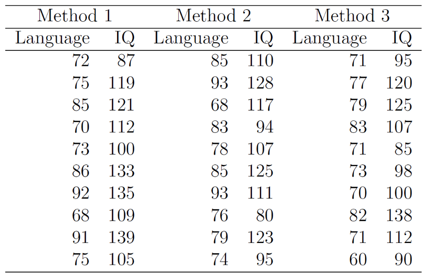

```{r include=FALSE}
knitr::opts_chunk$set(echo = TRUE)

if ( ! require('haven'))
  install.packages('haven')
if ( ! require('car'))
  install.packages('car')
if ( ! require('emmeans'))
  install.packages('emmeans')
if ( ! require('ggplot2'))
  install.packages('ggplot2')
library(ggplot2)
```

<!-- This code is to turn on or off the solutions -->
```{block include=(!params$inc_solu)}
<style>
.section.level5 {
  display: none ;
}
</style>
```

<!-- This code is to ensure the iframe is not cached and always load the most recent version -->
<head>
    <meta http-Equiv="Cache-Control" Content="no-cache" />
    <meta http-Equiv="Pragma" Content="no-cache" />
    <meta http-Equiv="Expires" Content="0" />
</head>


## Lab 10 - Week 11 {-}

### Recall Lecture 10: {#recall -}

 - Outliers and Influential Points
 - Variance Inflation Factors
 - Multicollinearity
 - Linear Statistical Models
 - ANOVA as Regression 
 - ANCOVA

### Lab Objectives {-}

On completion of this lab you will be able to:

 - apply linear regression models with indicator variables instead of ANOVA
 - understand the reason for including covariates and using ANCOVA
 - identify circumstances where ANCOVA is valuable over ANOVA

### Overview {-}

In the Week 10 lecture we covered Outliers and Cook’s Distance, Variance Inflation Factors for detecting multicollinearity, Linear statistical models, ANOVA as Regression, and ANCOVA.

### Data Files {-}
```{r echo=FALSE}
xfun::embed_file("Lab_09_Surgical.sav")
```  
<br>
```{r echo=FALSE}
xfun::embed_file("Lab_03_Fertilizer.sav")
```  
<br>
```{r echo=FALSE}
xfun::embed_file("Lab_10_Language.sav")
```

```{r include=FALSE}
S_files = list.files(pattern='10_S_.*')
if(length(S_files) == 0){S_add_files = F} else {S_add_files = T}
```

```{r echo=FALSE, results='asis', eval = params$inc_solu & S_add_files}
cat("### Additional Solution Files {-}")
```
  
```{r echo=FALSE, include = params$inc_solu & S_add_files}
zip::zipr(zipfile = "Lab_10_Additional_Files.zip", files = S_files)
xfun::embed_file("Lab_10_Additional_Files.zip")
```  


## Model Diagnostics 

### Survivial Time Data Revisted

Recall the data set used last week in **Lab_09_Surgical.sav** which recorded the survival time (measured in days) for patients undergoing a particular type of liver operation. The predictor variables we are interested in for this exercise are:  

 - $X_1$ a blood clotting score
 - $X_2$ a liver function test score

#### Fit a multiple linear regression model with $X_1$ and $X_2$ as predictors. Look to see if the predictors are statistically significantly linearly related to survival time. {-}


##### Solutions  

```{r include = FALSE}
data = haven::read_sav('Lab_09_Surgical.sav')
data = as.data.frame(data) 
```

```{r include = TRUE}
summary(lm(Survival1 ~ BloodClot + Liver1, data))
```

Based on the above output, the only predictor that we can identify as significantly linearly related to survival time is liver function test score (p < 0.001).

#### Last week we identified that blood clotting score and liver function score were statistically significantly correllated, however the sample correlation was not particularly high. Assess the multicollinearity between these two predictor variables using the Variance Inflation Factor (VIF). {-}

##### Solutions

```{r include = TRUE}
plot(BloodClot~Liver1,data=data)
vif(lm(Survival1 ~ BloodClot + Liver1, data))
```

The VIF is 1.34. Since this is less than 5 (conservative), we can safely say that multicollinearity does not exist.  


#### The final model from last weeks lab was a multiple regression model relating survival time, $Y$, to liver function test score, $X_2$, and Enzyme function test score, $X_4$ and included a centred two way interaction term. {-}

Are there any observations which have very large Cook's distance compared to the rest? What does this tell us about the effect of those particular observations?


Pass the model to the `cooks.distance()` function.

```{r eval=FALSE}
data$LiverC <- data$Liver1 - mean(data$Liver1)
data$EnzymeC <- data$Enzyme1 - mean(data$Enzyme1)
model <- lm(Survival1 ~ Liver1 + Enzyme1 + LiverC:EnzymeC, data)
cooks.distance(model)
```


Use the R code above. You are able to get some summary statistics for the collection of Cook's distances and look at what the maximum is. 


##### Solutions

From the Figure below there seems to be one observation which is far more influential than the others. This is in fact observation 5 which we flagged as a potential outlier from consideration of the residual plots.

```{r}
data$LiverC <- data$Liver1 - mean(data$Liver1)
data$EnzymeC <- data$Enzyme1 - mean(data$Enzyme1)
model <- lm(Survival1 ~ Liver1 + Enzyme1 + LiverC:EnzymeC, data)
cooks <- cooks.distance(model)
plot(cooks)
abline(h=qf(p = 0.50,df1 = 5, df2 = 54-5),col=2)

```

The plot shows the Cook's distance for each observarion. The red line indicates the 50th percentile of an F distribution with $df1 = p + 1$, and $df2 = n – p – 1$ where p is the number of predictor variables. An informal way to test is to test if any of the Cook's distances are greater than 1. 

It appears that there is one influential point in the data set and this is worth investigating to ensure that it is not an error. 


#### Try refitting your regression model excluding particular individual observations which have large Cook's D values. Have the regression coefficients changed very much? {-}


It's possible to create a new data frame with the 5th row removed as follows:

```{r eval=FALSE}
dataWithout5 <- data[-5,]
```


In jamovi, under the Data tab, you'll find a button for 'Filters'. Add a new filter to the data set. Specifying the formula `ROW() != 5` will filter out the fifth row from the analyses, causing them to re-run.

Have the regression coefficients changed very much?


##### Solutions

```{r}
dataWithout5 <- data[-5,]
summary(lm(Survival1 ~ Liver1 + Enzyme1 + LiverC:EnzymeC, dataWithout5))
```

Refitting the regression model without observation 5 does result in the regression coefficients changing for the interaction term and the enzyme test score term. Is this a better model for the remaining data? The $R^2$ value suggests not.


## ANOVA as Regression

### Fertilizer Data Revisted

In an effort to determine whether there was any difference between three types of fertilizer, agricultural researchers subdivided a 30 hectare farm into plots of 2 hectares each. Of these 15 plots, five were treated with fertilizer A, five were treated with fertilizer B, and five were treated with fertilizer C. Wheat was planted on the farm and, at the end of the season, the number of tonnes reaped was measured. The data is available as *Lab_03_Fertilizer.sav*.

In an earlier lab, we considered this example as a simple Model One-Way ANOVA,

where:

 - $Y$ is the tonnes of wheat reaped per two hectare plot.
 - $i$ = 1, 2 or 3 indicates the fertiliser types A, B, or C.
 - $j$ = 1, ..., 5 corresponds to different plots treated with each fertilizer type.
 - $\mu_i$ is the population mean tonnes of wheat reaped per two hectare plot for plots treated with fertiliser $i$.
 - $\mu$ is the overall population mean tonnes of wheat reaped per two hectare plot, i.e., the average across all 3 fertiliser types. 
 - $\alpha_i$ is the effect of fertiliser $i$ on the population mean tonnes of wheat reaped per two hectare plot, i.e. the difference between $µ_i$ and $µ$.
 - $\epsilon_{ij}$ is the error term for the $j$th plot treated with fertiliser $i$. Assumed to be $N(0, \sigma^2)$.

To consider this same example as a special case of regression we can use the model:

  $$ Y = \beta_0 + \beta_1X_1 + \beta_2X_2 + \epsilon $$

where the fertilizer factor is encoded using indicator variables $X_1$ and $X_2$ as shown in the table below.

  | Fertilizer Type | $X_1$ | $X_2$ |
  |-----------------|-------|-------|
  |     A (i = 1)   |   0   |   0   |
  |     B (i = 2)   |   1   |   0   |
  |     C (i = 3)   |   0   |   1   |


#### Why can these two models be considered equivalent? {-}

##### Solutions

In each case, the model is of separate mean wheat yields for each fertilizer type, with the variation around that mean represented by a normally distributed error term. This is shown in the table below. We are simply using different symbols and in the regression model we use the variables $X_1$ and $X_2$ to indicate the fertilizer type but the model is exactly the same.

  | Fertilizer Type | $X_1$ | $X_2$ |            ANOVA          |           Regression         |
  |-----------------|-------|-------|---------------------------|------------------------------|
  |     A (i = 1)   |   0   |   0   | $(\mu+\alpha_1)+\epsilon$ | $(\beta_0)+\epsilon$ |
  |     B (i = 2)   |   1   |   0   | $(\mu+\alpha_2)+\epsilon$ | $(\beta_0+\beta_1)+\epsilon$ |
  |     C (i = 3)   |   0   |   1   | $(\mu+\alpha_3)+\epsilon$ | $(\beta_0+\beta_2)+\epsilon$ |


#### How many indicator variables would be required if there were four fertilizer types in our experiment? How many indicator variables are required to encode a factor with ‘a’ levels? {-}

##### Solutions

Three indicator variables would be required to encode four fertilizer types. More generally, $a - 1$ indicator variables are required to encode a factor with $a$ levels.

#### Create two new columns in the data set. Label them $X_1$ and $X_2$ and encode the fertilizer type information as indicated. {-}

Here we're "Recoding" the `Type` variable. We want to recode the values of `Type` into $X_1$: `A` => `0`, `B` => `1`, and `C` => `0`. Similarly, we want to recode the values of `Type` into $X_2$: `A` => `0`, `B` => `0`, and `C` => `1`.

 We can create these new columns, and fit the regression model as follows:

```{r}
data <- haven::read_sav('Lab_03_Fertilizer.sav')
data$Type <- as.factor(data$Type)
data <- as.data.frame(data)

data$X1 <- NA
data$X2 <- NA

data$X1[data$Type == 'A'] <-  0 # this is checking if Type is A, make X1 equal 0
data$X2[data$Type == 'A'] <-  0 # this is checking if Type is A, make X2 equal 0
data$X1[data$Type == 'B'] <-  1 # this is checking if Type is B, make X1 equal 1
data$X2[data$Type == 'B'] <-  0 # this is checking if Type is B, make X2 equal 0
data$X1[data$Type == 'C'] <-  0
data$X2[data$Type == 'C'] <-  1
```


In jamovi, add a new 'Transformed variable'; (Data -> Add -> Transformed Variable -> Append), and name it `X1`. Choose the *Source variable* (the one we're recoding) as `Type`, then under *using transform* choose *Create new transform...*. We're now constructing a transform to 'recode' the values of `Type` (A, B, C) into the values `0`, `1`. Look for the button *+ Add recode condition*, and add two conditions (click it twice). This gives us two *if statements* and an *else statement*.

In these statements, `$source` refers to the *Source variable* that we chose in the previous screen (`Type`). Enter the statements so it reads:

```
if $source == 'A'     use 0
if $source == 'B'     use 1
if $source == 'C'     use 0
```

When done, press enter, or click outside the conditions box. Take a look at the contents of the `X1` variable, and check that the values of `Type` have been recoded accordingly.

Repeat the process for the variable `X2`, however it will be recoded slightly differently. Refer to the table above.

#### Fit a regression model explaining wheat yield in terms of $X_1$ and $X_2$. {-}


Fit the model using `lm()` function


Analyses -> Regression -> Linear Regression. We want `X1` and `X2` to be treated as continuous variables, so we specify them as covariates.

##### Solutions

```{r}
model <- lm(Tonnes ~ X1 + X2, data)
model
```

  $$ E(Y) = 2.94 + 0.02X_1 - 0.14X_2 $$

#### What are the estimated average wheat yields for 2 ha plots treated with fertilizer types A, B and C? {-}

##### Solutions

Using this equation and the appropriate values of $X_1$ and $X_2$ that represent fertilizer types A, B and C, we can determine the estimated average wheat yields as shown in the following table:


| Fertilizer Type | $X_1$ | $X_2$ | Estimated average wheat yield       |
|-----------------|-------|-------|-------------------------------------|
|    A (i = 1)    |   0   |   0   |  2.94 + 0.02 ×  0 - 0.14 ×  0 = 2.94 |
|    B (i = 2)    |   1   |   0   |  2.94 + 0.02 ×  1 - 0.14 ×  0 = 2.96 |
|    C (i = 3)    |   0   |   1   |  2.94 + 0.02 ×  0 - 0.14 ×  1 = 2.80 |

#### Think about the following null and alternative hypotheses testing the effect that fertilizer type has on the wheat yield. {-}

$H_0 : \beta_1 = 0$

$H_A : \beta_1 \neq 0$ 

and

$H_0 : \beta_2 = 0$

$H_A : \beta_2 \neq 0$ 


Why is using these two hypothesis tests not equivalent to testing for a significant effect of type through performing the ANOVA F test?  


##### Solutions

The first null and alternative hypothesis tests whether there is a difference in the means between the reference group (coded $X_1 = 0$, $X_2 = 0$) and the level coded $X_1 = 1$, $X_2 = 0$.

The second null and alternative hypothesis tests whether there is a difference in the means between the reference group (coded $X_1 = 0$, $X_2 = 0$) and the level coded $X_1 = 0$, $X_2 = 1$.

These two tests are performed separately.

For the F test in an ANOVA, we are testing if at least one of the means is different, but we are testing them jointly. A subtle difference. This highlights the need to use the ANOVA table to test if the factor as a whole is a statistically significant predictor of the response variable. If you are interested in specific pairwise comparisons, the data and or model should be modified. 


#### Fit a linear model using the nominal Fertilizer Type variable directly. Compare the results to that of the regression model. Explain the meaning of the terms in the Parameter Estimates table. {-}

 

```{r, eval=FALSE}
model <- lm(Tonnes ~ Type, data)
model
```


Analyses -> Regression -> Linear Regression. This time, simply specify `Tonnes` as the dependent variable and `Type` as a factor.

##### Solutions

```{r, echo=FALSE}
model <- lm(Tonnes ~ Type, data)
model
```

The underlying message is that ANOVA and regression are just specific examples of a more general type of model.


## Analysis of Covariance - ANCOVA

### Methods of Teaching a Language

The effectiveness of three different methods of teaching a foreign language were compared. 30 students were randomly assigned to one of three groups corresponding to the different instruction methods. A language test is given at the end of the instruction period. IQ scores taken before the language instruction are also available. The data are given in the table below and in *Lab_10_Language.sav*.

<center> {width=400px} </center>

#### Does the teaching method affect language test scores? Produce a box-plot of language scores, comparing the different groups. Follow this up with a one-way analysis of variance. {-}

##### Solutions

```{r}
data <- haven::read_sav('Lab_10_Language.sav')
data <- as.data.frame(data)
data$METHOD <- as.factor(data$METHOD)

plot(LANGUAGE ~ METHOD, data)
```

The graph above suggests that perhaps students taught using Method 2 performed best and students taught using Method 3 the worst based on average language test scores; however, we need to test for statistical significance of any such differences.

```{r}
model <- lm(LANGUAGE ~ METHOD, data)
Anova(model,type = 2)
```

Using the one-way fixed effects ANOVA we find that we are unable to reject the null hypothesis at the 5% significance level (p-value = 0.109), and therefore conclude that there is insufficient evidence to find a statistically significant difference in population mean language test scores due to teaching method.

#### In the above analysis, IQ score was ignored, and a one-way ANOVA conducted. Is such an approach adequate? Should an ANCOVA instead be considered, having both Language Score and IQ as predictors, or is it unnecessarily complex? {-}

  a. Determine the mean IQ scores, and mean Language scores, for each teaching method? Has random assignment of students to teaching method group ensured equivalent comparison groups in the ANOVA?
  b. Consider also parallel boxplots of Language Scores by Method. What does this suggest about the ANOVA model?
  c. Consider and interpret a scatterplot and correlation of Language Score and IQ score.
  d. What do the above results suggest about the value of considering an ANCOVA model having both Method and IQ score? How might this experiment be affected?

##### Solutions

```{r}
library(jmv)
jmv::descriptives(
  formula=LANGUAGE+IQ~METHOD,
  data=data,
  n=FALSE, missing=FALSE, median=FALSE, min=FALSE, max=FALSE)
```

Although the students were randomly allocated, there are potentially some differences between the three groups with respect to mean IQ.

The mean language scores for Methods 1, 2 and 3 respectively are 116, 109 and 107 respectively. Such differences (in types of subjects within each group (Method)) could affect decisions re differences in population mean scores due to Methods (differences in types of subjects could confound the results).

If IQ is an important factor in learning a language we might expect teaching Method 1 to perform better than Method 3 because of the effect of IQ (since mean IQ for Method 1 is larger than mean IQ for Method 2).

Thus IQ may confound the effect of the teaching method. 

This would suggest that ANCOVA may be more useful for analysis.

```{r}
plot(LANGUAGE ~ METHOD, data)
```

Boxplots show there is large within-Method variation (large error variation) which will reduce the chances of detecting differences in population mean Language scores due to Method (which was what ANOVA was attempting to test/detect).

```{r}
plot(IQ ~ METHOD, data)
```

Boxplot indicates Method may be related to or affected by IQ.

```{r}
plot(LANGUAGE ~ IQ, data)
```

The scatterplot suggests a linear association between outcome (Language score) and the covariate (IQ Score).

One-way ANOVA may be inadequate. The study perhaps should have considered blocking on IQ before randomly assigning to the three Teaching Methods (actually addressing Q9).

Boxplots show large within-Method variation – hard to detect differences in population mean Language scores due to Method (part b).

Means indicate differences in mean IQ scores within each of the Teaching Methods – could affect test for differences in population mean Language scores due to Teaching methods (part a).

Scatterplot and statistically sig Correlation (p=0.000, 3 dec pl) indicate a linear association between outcome (Language score) and the covariate (IQ Score) (part c).

Given above, the MSE will reduce by inclusion of covariate, IQ score (IQ score will explain some of the currently unexplained variation), and increase the chances of detecting differences in population mean Language scores (after accounting for covariate) due to Method.

This would suggest that ANCOVA may be more useful for analysis than one-way ANOVA, and not unnecessarily complex.
    
#### Consider a linear model for language test score using teaching method AND IQ as explanatory variables. Express this model algebraically, defining all symbols used. (Do not include an interaction term at this stage.) {-}

i.e., write the generic (i.e., do not use the estimated values) algebraic model for the linear relationship involving ‘Language Score’, ‘Method of Teaching and ‘IQ Score’ without an interaction term. Define each symbol in your model.

##### Solutions

  $$ Y_i = \beta_0 + \beta_1X_1 + \beta_2X_2 + \beta_3X_3 + \epsilon_i $$

where:
   
 - $Y_i$ is language test score for the ith individual, Note: We strictly speaking should have subscripts $i$ for each of the $X_j$ and $\beta_j$, $j$ = 1,2,3; these have been omitted to reduce complexity (look less overwhelming).
 - $\beta_0$, $\beta_1$, $\beta_2$ regression parameters
 - $\epsilon_i \sim N(0, \sigma^2)$ error term for ith individual ... our usual normally distributed random error term modelling any unexplained variation
 - $X_3$ represents `IQ` score
 - $X_1$ and $X_2$ are indicator variables used to represent the three teaching methods.
 
  | Teaching Method | $X_1$ | $X_2$ |
  |-----------------|-------|-------|
  |        1        |   0   |   0   |
  |        2        |   1   |   0   |
  |        3        |   0   |   1   |

Comment: This is an alternative form for coding the indicator variables.  Method 1 is zero for both indicators – this means it is the reference category (the intercept now is the population mean for this category) and the coefficient for $X_1$ represents the difference in population means between the reference category and $X_1$ (the coefficient for $X_2$ is similarly defined relative to the reference category).

#### Fit this model. Write the fitted equation for the linear relationship involving Language Score, Teaching Method, and IQ score, without an interaction term. Give a full quantitative description of the fitted model. {-}

It turns out that many statistical softwares can perform the recoding step we performed in section 10.1, automatically.


Some other software such as SPSS uses  *simple coding*. This is where the variables are coded as follows: 

  | Teaching Method | $X_1$ | $X_2$ |
  |-----------------|-------|-------|
  |        1        |   1   |   0   |
  |        2        |   0   |   1   |
  |        3        |  -1   |  -1   |

Fortunately in R, the `lm()` function uses *dummy coding* by default which is what we used above. This is:

  | Teaching Method | $X_1$ | $X_2$ |
  |-----------------|-------|-------|
  |        1        |   0   |   0   |
  |        2        |   1   |   0   |
  |        3        |   0   |   1   |

Both codings are more-or-less equivalent, however *dummy coding* can be easier to understand.


To fit this model in jamovi; Analysis -> Regression -> Linear Regression. Specify `LANGUAGE` as the dependent variable, specify `IQ` as a covariate, and specify `METHOD` as a factor. By specifying `METHOD` as a factor, we instruct jamovi to construct coding variables in the background.

##### Solutions

```{r}
model <- lm(LANGUAGE ~ METHOD + IQ, data)
model
```

The equation of the fitted model is:

  $$ E(Y) = 42.104 + 4.908X_1 -2.1607X_2 + 0.315X_3 $$
  
Thus for all learning methods, the language test score can be expected to increase by 0.315 on average for every 1 point increase in student IQ score.

The effect of the different learning methods can be thought of as separate Y intercepts for:

Method 1: 42.104 (the reference category)

Method 2: 42.104 + 4.908

Method 3: 42.104 - 2.1607

Essentially the effect of the different learning methods is to shift this linear relationship between language score and IQ up or down. On average, for students with any particular IQ, test scores will on average be 4.908 higher for method 2 compared to method 1 and 2.161 lower for method 3 than method 1.


```{r}
data = cbind(data,predict(model,interval="confidence"))
ggplot(data = data, aes(x=IQ, y=LANGUAGE, colour = METHOD)) + 
  geom_point(size = 2) + 
  geom_line(aes(y=fit))# + geom_ribbon(aes(ymin=lwr,ymax=upr),alpha=0.05)
```


#### Does the teaching method affect language test scores? State the relevant null and alternative hypotheses, p-value and provide an appropriate conclusion. {-}


You *can* pass the `lm()` model you've created to the `anova()` function to get the appropriate statistic, however, by default `anova()` in R uses *type 1* sums-of-squares, where as most other software uses *type 3* sums-of-squares. To get the results with type 3 sums-of-squares, use the `Anova()` function from the `car` package, and pass it the argument `type=3`. 

When working out what type of sums-of-squares to use, first consider if you care more about one particular variable more than others. If not, we shouldn't use type 1 sums-of-squares. Now consider if you have interaction in your model, if so, use type 3 sums-of-squares. If no interaction in the model, use type 2 sums-of-squares. 

For balanced studies the results will be the same. When studies are unbalanced, the choice of sums-of-squares becomes an important one. 


Using the Linear Regression you fitting in question 4, under the *Model Coefficients* section you'll find an option for *ANOVA test*.

##### Solutions

  $H_0: \beta_1 = \beta_2 = 0$

  $H_a :$ At least one of $\beta_1$, $\beta_2$ is not zero.
  
```{r}
library(car)
Anova(model, type=2)
```

The test statistic is F = 3.415 and associated p-value is 0.048.

The teaching method has a statistically significant effect on the population mean language test score of students (p = 0.048) when IQ is used as a covariate. (N.B. We could then carry out post-hoc comparison of means. For example, LSD test, at a 5% significance level, shows that teaching methods 2 and 3 result in significantly different average language test scores but teaching method 1 cannot be distinguished from either of the others. See below)

```{r}
grid <- emmeans::emmeans(model, ~METHOD:IQ)
pairs(grid, adjust='tukey')
```

#### In linear models such as these, to what does the *Mean square* of the residuals relate? Explain how the inclusion of the IQ score in the model has affected the mean square of the residuals in this ANCOVA model compared to the mean square of the residuals for the original one-way ANOVA model. How has that affected the analysis of the question of interest, i.e., whether the teaching method affects language test scores? {-}

##### Solutions

From the output: Mean square of the residuals is 38.4; the sample estimate of the variance, $\sigma^2$ of the error term, $\varepsilon$, in the linear model.

For the previous one-way ANOVA model, the Mean square of the residuals is 63.4. Including the IQ score in the model has helped to explain much of the previously unexplained variation in language test scores reducing the error sum of squares and subsequently the mean square error. Thus the F ratio relating to the test of the effect of the teaching method is much larger for the ANCOVA model and we are more likely to declare a statistically significant effect.

This is consistent with the concept we have explored several times throughout this course. The smaller the error variance, the easier it is to detect the effect of a particular explanatory variable.

#### Sometimes we aren't particularly interested in the effect of the covariate. Rather we only include it in the model to reduce the residual variation and increase the chance of detecting an effect we are interested in (i.e., increasing power). Use this analysis to: {-}

  a. state the 95% confidence interval for the parameter relating to the effect of the change in language test score with changes in IQ score;
  b. Interpret the 95% confidence interval from part a.

 

```{r}
confint(model)
```


You'll find the option for *Confidence intervals* under the *Model coefficients* section.

##### Solutions

From output: (0.165, 0.466)

Or 95% confidence interval for $\beta_3$

  $$ = \beta_3 \pm t \times SE(\beta_3) $$
 
  $$ = 0.315 \pm 2.056 \times 0.0732 $$
  
  $$ = 0.315 \pm 0.150 $$
  
  $$ = [0.165, 0.465] $$

We are 95% confident that for a unit increase in IQ score, the true population language test score will increase by between 0.165 and 0.465 units, on average, when Method is held constant.
    
#### How does inclusion of an interaction term affect the model? Is an interaction term useful in this example? {-}

##### Solutions

```{r}
data$IQ_c = data$IQ - mean(data$IQ)
model <- lm(LANGUAGE ~ METHOD + IQ + IQ:METHOD, data)
Anova(model,type = 3)
summary(model)
```

In this particular example, the interaction term is not statistically significant (p = 0.37) so the previous model would be preferred. To understand the interaction effect however, consider the scatterplot below. As in the previous model, the data is modelled using three lines but including an interaction term allows the lines to have separate slopes.  This is consistent with our definition of interaction. The slope represents the effect of IQ on language test score. If this changes for the different teaching methods then obviously we have a Teaching Method by IQ interaction.

```{r}
data2 = data[,1:3]
data2 = cbind(data2,predict(model,interval="confidence"))

ggplot(data = data2, aes(x=IQ, y=LANGUAGE, colour = METHOD)) + 
  geom_point(size = 2) + 
  geom_line(aes(y=fit)) #+ geom_ribbon(aes(ymin=lwr,ymax=upr),alpha=0.05)
```

We can see this in detail looking at the fitted model:

  $$ \hat Y = 26.834 + 33.912X_1 + 15.562X_2 + 0.4471X_3 - 0.258X_1(X_3-110.7) - 0.155X_2(X_3-110.7) $$
  
Note the centring of the continuous IQ variable in the interaction term.

Thus for each teaching method, the fitted model is equivalent to the lines in the following table:

  | Method | $X_1$ | $X_2$ | $\hat Y =$ |
  |--------|-------|-------|------------|
  |    1   |   0   |   0   | $26.834 + 0.4471X_3$ |
  |    2   |   1   |   0   | $26.834 + 33.912X_1 + 0.4471X_3 - 0.258X_1(X_3-110.7)$ |
  |    3   |   0   |   1   | $26.834 + 15.562X_2 + 0.4471X_3 - 0.155X_2(X_3-110.7)$ |

####  Instead of including IQ as a covariate, how could we have designed this experiment in order to address the issue of IQ score potentially confounding the results? What would be the advantages or disadvantages of these two methods? {-}

##### Solutions

We could order the students by IQ. The top 3 students could then be randomly allocated across the three learning methods, then the next 3, etc until all 30 students are allocated. If we then conduct a one-way ANOVA we should have better matched comparison groups than we achieved just by random allocation.  However, we would not get the reduction in error variance we achieved by including IQ as a covariate. We may get some of this benefit by including the blocks of three students as another variable in a two-way ANOVA.

